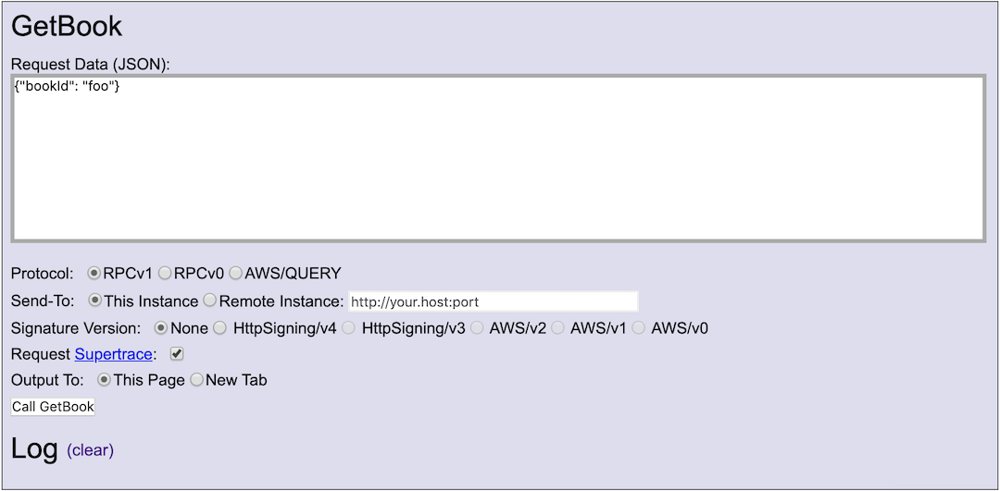
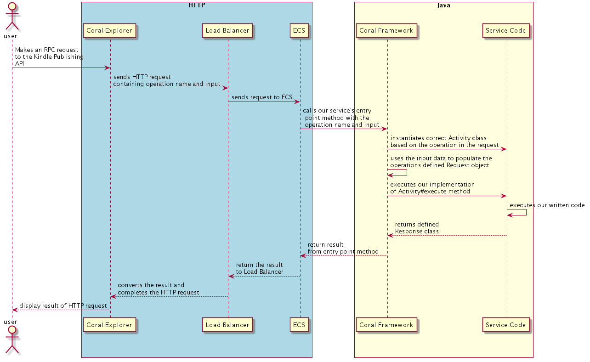

### Project Preparedness Task 3: I Spy An API Tool

**Reviewer: Unit-4-Instructor-Reviewers**

So far we’ve learned two different ways to send requests to our services. In Unit 2, we used RDE to invoke an API in 
our service and in Unit 3, we used `cURL`. In Unit 4, our Coral service comes with a new tool to invoke our APIs. It is 
called the Coral Explorer. Let’s check it out!

Open http://localhost:1184/explorer/index.html in a browser. This makes a request to your locally running 
ATAKindlePublishingService to display the explorer index page. If you are unable to connect, run your service by 
executing `rde workflow run`. Behold - the ATACurriculumKindlePublishingService Explorer! It's a UI tool for exercising 
your service when developing and testing. The left hand column has two sections, **Operations** and **History**. The 
**Operations** section contains each of the APIs defined in your Coral model package, 
[ATACurriculumKindlePublishingServiceModel](https://code.amazon.com/packages/ATACurriculumKindlePublishingServiceModel/). 
Your service currently has only implemented one of them, `GetBook`. Click on `GetBook` in the **Operations** section - 
and we’ll give this a spin. 

The purple window on the right hand side will now be populated with a request to `GetBook`. The explorer will 
automatically populate JSON that matches the inputs defined by your model. You should see the following:



You may be wondering where the RESTful verbs, paths, and resources went. Our service in 
this project uses an alternative architecture that you're likely to see at Amazon: Remote Procedure Call, or RPC. RPC 
endpoints are similar to Java methods, and we usually put each endpoint in its own Activity class. When we call RPC 
endpoints over HTTP, they always use POST requests, and they return exceptions a lot like RESTful services; but all 
that's handled by the explorer UI.

At the end of the day, we’ve still got an API to call, just a slightly different way to call it. So, let’s do it! At 
the bottom of the purple window you will see a button that says ‘Call GetBook’. Clicking this will make a call to your 
local service’s `GetBook` API with the request data defined above. So a call to `GetBook` will be made with a `bookId` 
that has the value `foo`. Go ahead and click! (It might take a little while... we’ll fix that later!)

Now the **Log** section will have request and response information. Since we don’t have a book with the id `foo`, we 
will receive a `KindlePublishingClientException`. A client exception hints to our client that they are the one causing 
the error, by calling the service with a bad id.


Now, let’s make a request for a book that actually exists. Replace the value `foo` with 
`book.69c16130-60b5-485a-8326-7f79d3feb36d`. This should return a book that is stored in our `CatalogItemVersions` 
DynamoDB table.  We are interacting with our local service running through RDE, but it’s getting data from the actual 
DynamoDB table in our AWS account. RDE is set up to allow us to interact with a specified AWS account from our local 
docker environment. This is defined in the project’s `definition.yaml` file under the "devAccount:" key.

Let’s walk through what’s happening here in our new architecture. The server code is running in AWS ECS 
(or mimicking it locally through RDE). The sequence of events when a client calls our deployed service is: 



[source](https://tiny.amazon.com/sao044u0/unit4RequestPath)

1. An HTTP request is submitted (containing data that conforms to the API contract)
2. This HTTP request is received by a load balancer. A load balancer is a single point of contact for a service. You 
can then put many servers behind your load balancer to be able to handle heavy amounts of traffic. It’s your load 
balancer’s job to distribute requests across your many servers. We were doing something a bit similar with Lambda. 
Its job was to find an available worker to run the service code when a request came into API Gateway. 
3. The load balancer forwards the request to a server where our ECS service is running our code.
4. Our ECS service returns and forwards the response back to the load balancer.
5. The load balancer packages the response into an HTTP response to send back to our client.
6. The Client receives the HTTP response.

Calling our local service running through RDE is a similar process, but RDE mimics what the load balancer and ECS are 
doing locally, behind the scenes.

Once you have a successful response from your locally running service, create a new file in the `resources` folder 
named `preparedness-task3.txt`, paste the JSON output of executing your `GetBook` request with bookId, 
`book.69c16130-60b5-485a-8326-7f79d3feb36d`, and create a CR. The successful response should start: 
```
{"book":
``` 

The title of your commit and CR must begin with `[PPT03]`. Submit the CR to Unit-4-Instructor-Reviewers (TEAM) for 
review, and once the CR is approved, push this code to your pipeline.

**Exit Checklist:**

* `rde wflow run preparedness-task3` passes
* Your CR with the output of your `GetBook` request has been approved by ATA-Instructors and pushed.
* PPT03 TCTs are passing in your pipeline.
